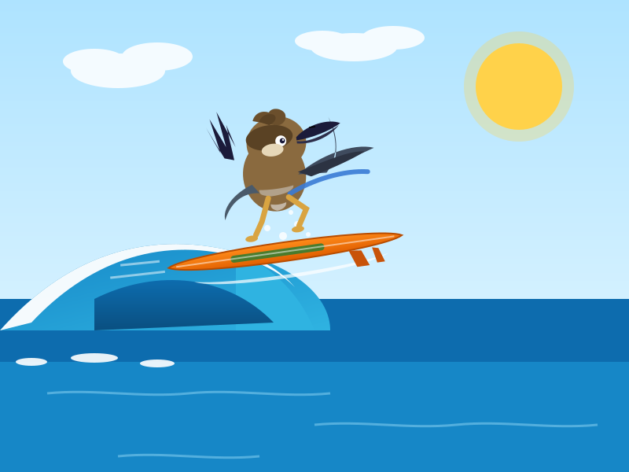
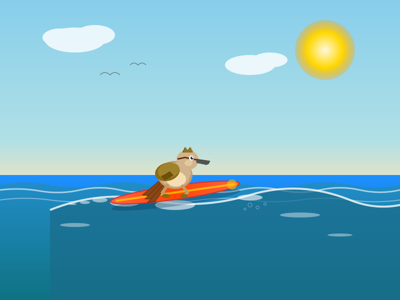
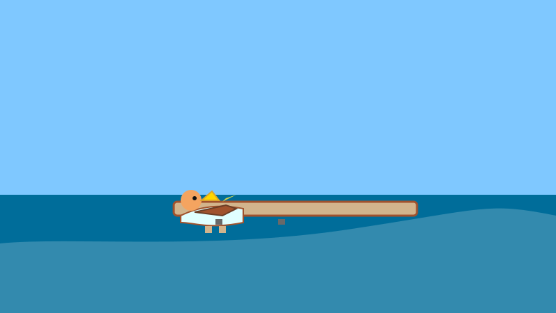
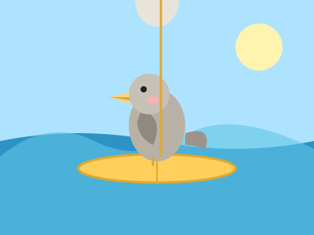
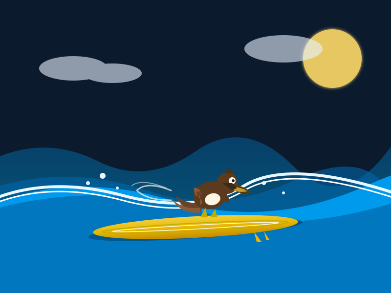
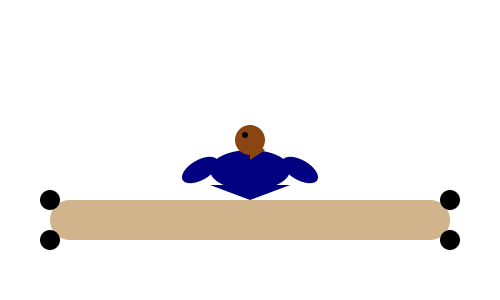
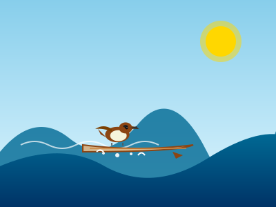
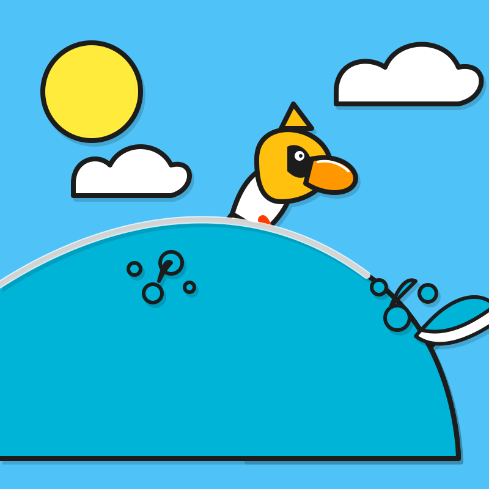
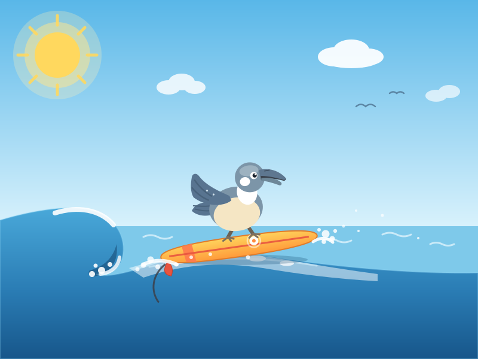
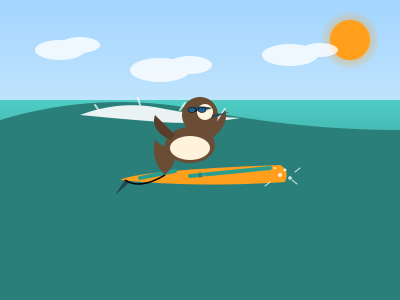

# sillybench

Silly benchmarks to test models on.

Every model release ships with a wall of impressive numbers. But everyone uses models so differently — different tasks, different prompts, different taste — that it's impossible to know whether a high score translates to anything in the real world. A model that tops a leaderboard can still be mediocre at *your* thing, and vice versa.

sillybench leans into that. These experiments are not rigorous, not representative, and produce no scores — just small, personal, slightly silly tasks (draw a kookaburra surfing a longboard, rebuild a local website) with each model's raw output kept side by side. Look at the results and decide for yourself. That's the point: the only benchmark that transfers to the real world is running a model on the things you actually do.

## Layout

Each **experiment** is a folder at the repo root:

```
kookaburra-surfing/          <- experiment folder
  prompt.md                  <- the exact prompt used for this experiment
  claude-opus-5.svg          <- model output, named after the model
  deepseek-v4-flash-0731.svg
  inkling-small.svg

peregian-digital-hub/
  prompt.md
  deepseek-v4-flash-0731.html

littlecove/
  prompt.md
  little-cove.jpg            <- the real place, for comparing outputs against
  photo-credit.md            <- where that photo came from, and its licence
  qwen3.8-27b.html
```

- `prompt.md` records the original prompt (the model implied by the output filename).
- An experiment folder may also hold a **reference asset** (e.g. a photo of the real place) to compare outputs against. It is not part of the prompt unless `prompt.md` says so.
- Each model's output is a **single file or folder named after that model** inside the experiment folder. Use a folder instead of a single file when the output is multi-part.

## How to run an experiment

```sh
uv run harness/run.py <experiment> <model>    # e.g. uv run harness/run.py peregian-digital-hub glm-5.3-flash
```

The harness sends the experiment's `prompt.md` to the model (via the homelab LiteLLM proxy) as a single user message, with **tool calling enabled**: the model gets `web_fetch` and `web_search` tools so it can read real websites and check facts instead of inventing content. The harness runs the tool loop, extracts the final html/svg, and writes it to `<experiment>/<model>.<ext>`. Sampling knobs (`--temperature`, `--top-p`, `--max-tokens`) are passed per vendor spec — see `.claude/skills/run-experiment/SKILL.md`.

Equivalently, point any model at `prompt.md` by hand and save its output under the experiment folder, named after the model.

---

## Gallery: Kookaburra Surfing a Longboard

> Prompt: *"Generate an SVG of a kookaburra surfing a longboard"*
>
> Text-based models wrote SVG code directly. Image-generation models produced raster images (PNG).

<table>
<tr>
<td align="center" width="33%"><br><strong>Claude Fable 5</strong></td>
<td align="center" width="33%"><br><strong>Claude Opus 5</strong></td>
<td align="center" width="33%"><br><strong>DeepSeek V4.1 Flash (EXL3)</strong></td>
</tr>
<tr>
<td align="center"><br><strong>DeepSeek V4 Flash (0731)</strong></td>
<td align="center"><br><strong>DeepSeek V4 Flash Vision Exp</strong></td>
<td align="center"><br><strong>Gemma 4 E4B</strong></td>
</tr>
<tr>
<td align="center"><br><strong>GLM 5.3 Flash</strong></td>
<td align="center"><br><strong>HY3 295B</strong></td>
<td align="center"><br><strong>Inkling Small</strong></td>
</tr>
<tr>
<td align="center"><br><strong>Laguna S 2.1</strong></td>
<td align="center"><br><strong>MIMO V2.5</strong></td>
<td align="center"><br><strong>MiniMax M2.7</strong></td>
</tr>
<tr>
<td align="center"><br><strong>Microsoft Copilot</strong></td>
<td align="center"><br><strong>Qwen 3.6 27B</strong></td>
<td align="center"><br><strong>Qwen 3.8 125B</strong><br><em>32GB Mac Mini, ~4 tok/s</em></td>
</tr>
<tr>
<td align="center"><br><strong>Qwen 3.8 27B</strong></td>
<td align="center"><br><strong>Step 3.7 Flash</strong></td>
<td></td>
</tr>
</table>
