# sillybench

Silly benchmarks to test models on. Right now there's one: **draw a kookaburra surfing a longboard.**

Every model release ships with a wall of impressive numbers. But everyone uses models so differently — different tasks, different prompts, different taste — that it's impossible to know whether a high score translates to anything in the real world. A model that tops a leaderboard can still be mediocre at *your* thing, and vice versa.

sillybench leans into that. It's not rigorous, not representative, and produces no scores — just a small, personal, slightly silly task with each model's raw output kept side by side. Look at the results and decide for yourself. That's the point: the only benchmark that transfers to the real world is running a model on the things you actually do.

## The prompt

> Generate an SVG of a kookaburra surfing a longboard

That's the whole prompt, verbatim from [`kookaburra-surfing/prompt.md`](kookaburra-surfing/prompt.md).

The model draws blind. It has to picture a scene (a bird, a board, a wave, and how they fit together) and write it out as shapes and coordinates, without ever seeing what it made. The subject is specific enough to catch vague answers. A generic brown bird isn't a kookaburra, and a longboard is a particular kind of surfboard. "Surfing" also rules out the skateboard kind.

## Results

One output per model, in alphabetical order, not ranked. Click a drawing to see the full-size SVG.

<!-- gallery: kookaburra-surfing -->
<table>
<tr><td align="center"><a href="kookaburra-surfing/claude-fable-5.svg">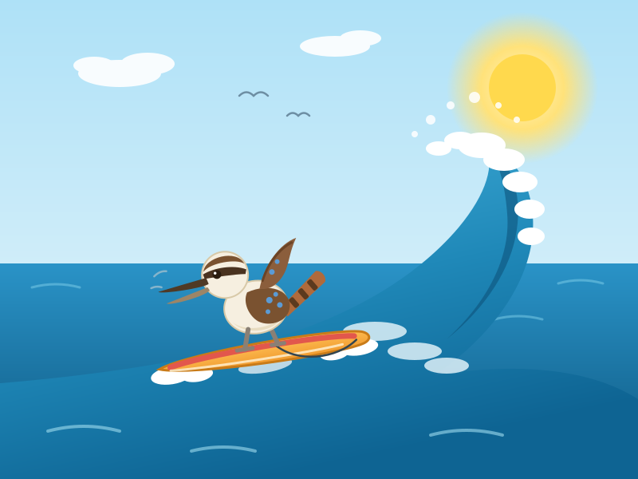</a><br><code>claude-fable-5</code></td><td align="center"><a href="kookaburra-surfing/claude-opus-5.svg">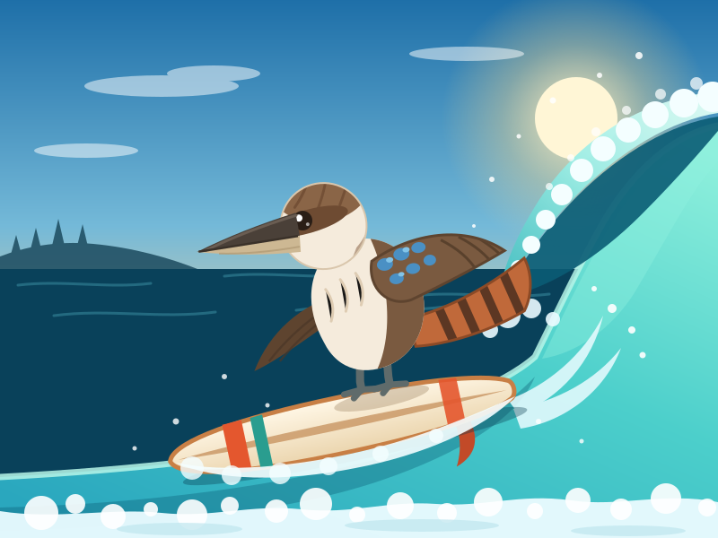</a><br><code>claude-opus-5</code></td><td align="center"><a href="kookaburra-surfing/deepseek-v4-flash-0731.svg">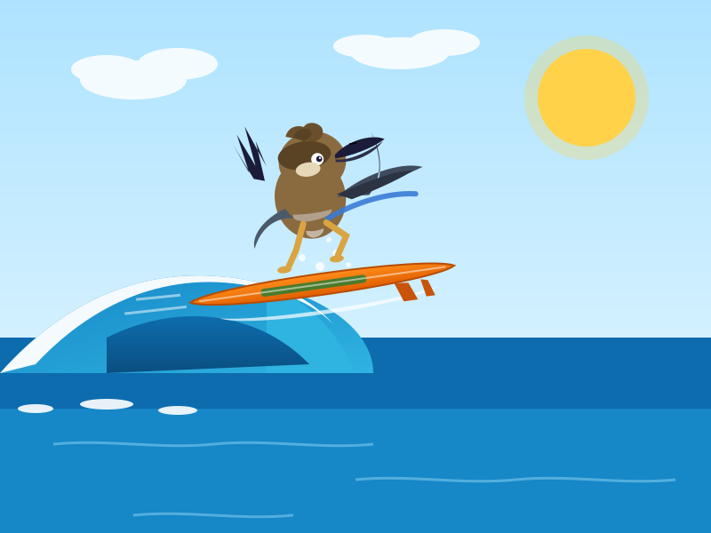</a><br><code>deepseek-v4-flash-0731</code></td></tr>
<tr><td align="center"><a href="kookaburra-surfing/deepseek-v4-flash-vision-exp.svg">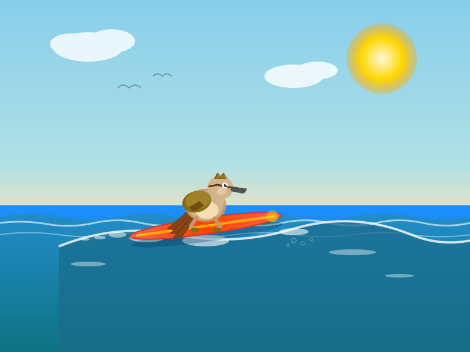</a><br><code>deepseek-v4-flash-vision-exp</code></td><td align="center"><a href="kookaburra-surfing/deepseek-v4.1-flash-exl3.svg"></a><br><code>deepseek-v4.1-flash-exl3</code></td><td align="center"><a href="kookaburra-surfing/gemma-4-e4b.svg">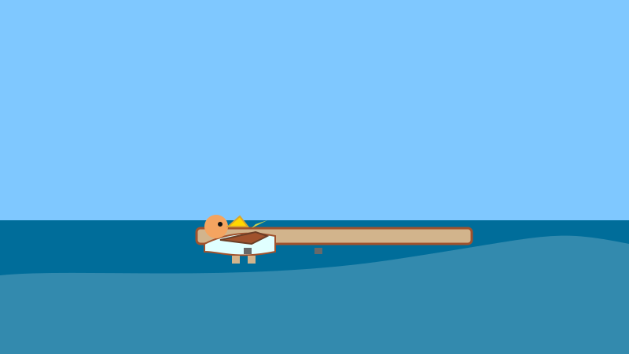</a><br><code>gemma-4-e4b</code></td></tr>
<tr><td align="center"><a href="kookaburra-surfing/glm-5.3-flash.svg">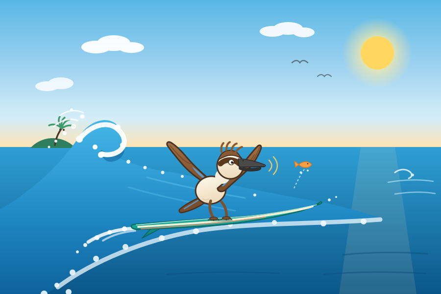</a><br><code>glm-5.3-flash</code></td><td align="center"><a href="kookaburra-surfing/hy3-295b.svg">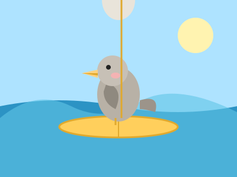</a><br><code>hy3-295b</code></td><td align="center"><a href="kookaburra-surfing/inkling-small.svg">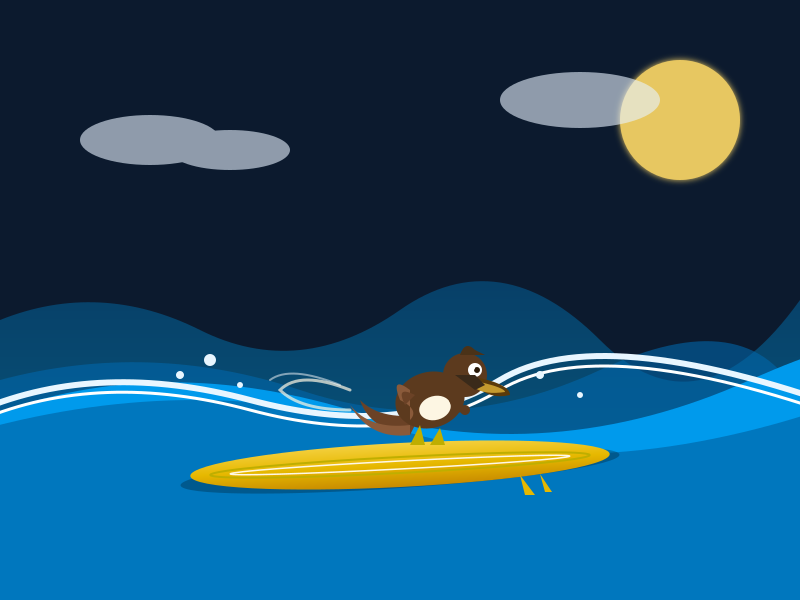</a><br><code>inkling-small</code></td></tr>
<tr><td align="center"><a href="kookaburra-surfing/laguna-s-2.1.svg">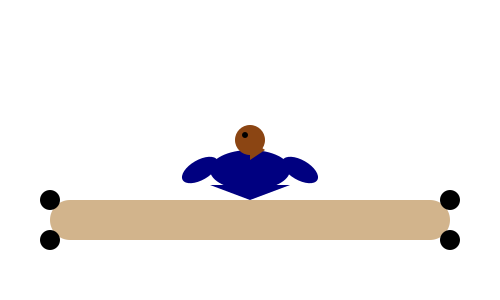</a><br><code>laguna-s-2.1</code></td><td align="center"><a href="kookaburra-surfing/mimo-v2.5.svg">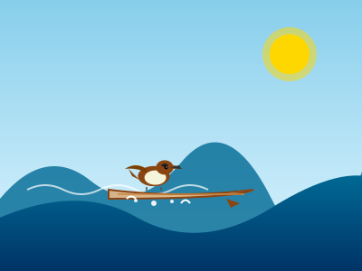</a><br><code>mimo-v2.5</code></td><td align="center"><a href="kookaburra-surfing/minimax-m2.7.svg">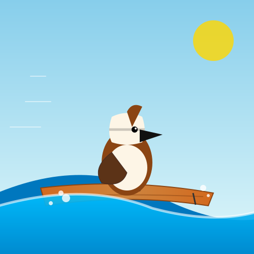</a><br><code>minimax-m2.7</code></td></tr>
<tr><td align="center"><a href="kookaburra-surfing/qwen3.6-27b.svg">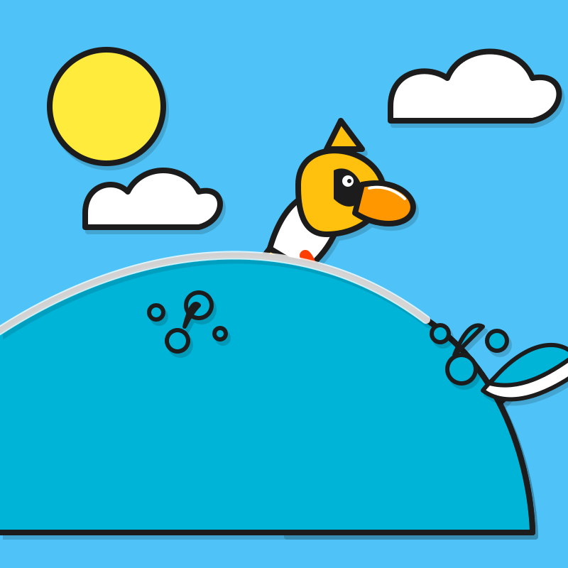</a><br><code>qwen3.6-27b</code></td><td align="center"><a href="kookaburra-surfing/qwen3.8-27b.svg">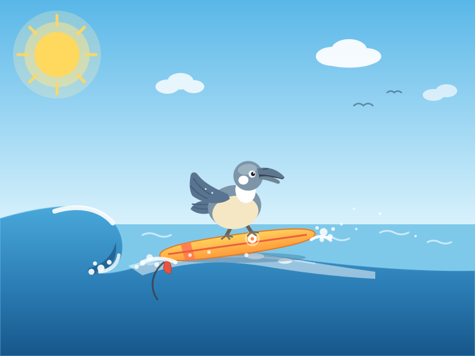</a><br><code>qwen3.8-27b</code></td><td align="center"><a href="kookaburra-surfing/qwen3.8-flash-next-mtplx-speed.svg">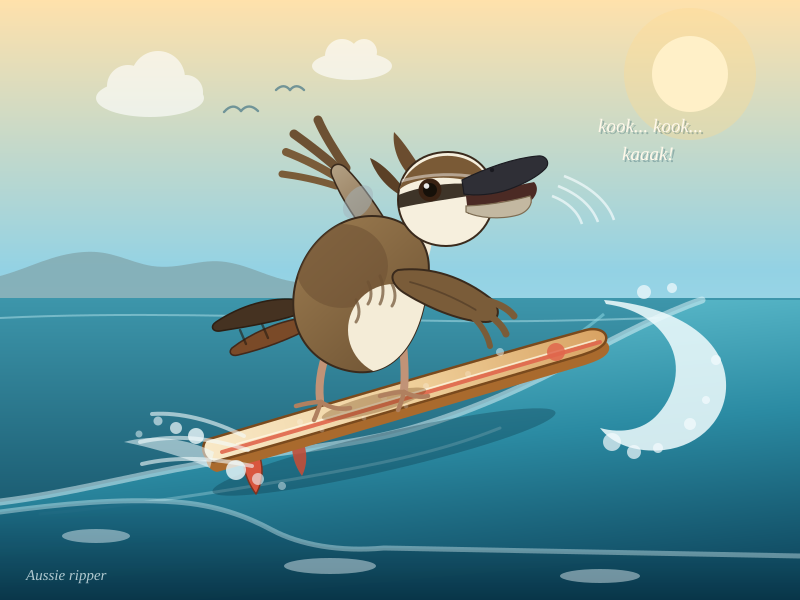</a><br><code>qwen3.8-flash-next-mtplx-speed</code></td></tr>
<tr><td align="center"><a href="kookaburra-surfing/step-3.7-flash.svg">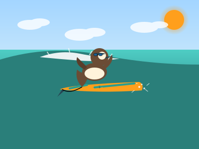</a><br><code>step-3.7-flash</code></td></tr>
</table>
<!-- /gallery -->

## What to look at

There are no scores, but these questions separate the drawings:

- **Is it a kookaburra?** The laughing kookaburra has an off-white head and belly, a dark stripe through the eye, and a heavy bill that's dark on top and pale underneath. Its wings are brown with pale-blue flecks, and its tail is barred rust and black.
- **Is it a longboard?** A longboard is long (about one and a half times the rider's height or more), wide, and round-nosed. A short board with a pointed nose is a shortboard.
- **Is it surfing?** The bird should be standing on the board, the board should be on a wave, and something should suggest motion. A bird sitting next to a plank on flat water doesn't count.
- **Does it hold together?** Check that the parts are attached, the layers are in the right order, and nothing is floating in mid-air.

For extra credit: longboarders walk up and down the board and hang ten off the nose. See whether any model knew that.

## How the outputs were made

Outputs committed from 2026-08-28 onward came from [the harness](#the-harness). Older ones were made before the harness existed, so their system prompt, sampling settings and tool access may be different. `git log -- kookaburra-surfing/<model>.svg` shows when each output landed. The commit message often records the hardware and quantization.

Keep in mind:

- **Each model has one sample.** Sampling is random, so a second run can produce a very different drawing.
- **Many ran on local weights.** Many of the models ran on a homelab (DGX Spark, RTX 5090), often quantized, so they may not match the vendor's hosted model. Where the variant matters, the filename says so (e.g. `deepseek-v4.1-flash-exl3`).

## Adding a model

1. **Run it** with the harness:

   ```sh
   uv run harness/run.py kookaburra-surfing <model>
   # e.g. with the vendor's recommended sampling:
   uv run harness/run.py kookaburra-surfing glm-5.3-flash --temperature 1.0 --top-p 0.95
   ```

   Or run it by hand. Give any model the prompt from `prompt.md` and save its SVG as `kookaburra-surfing/<model>.svg`.
2. **Look at it.** Open the SVG and check that it renders and isn't cut off.
3. **Refresh the grid** above with `uv run harness/gallery.py`. Don't edit the grid by hand.
4. **Commit.** Put the hardware, quantization and sampling settings in the commit message. That's the only place they're recorded.

Name the file after the model, in lowercase, as the model is served. Add a suffix when the variant matters (`-exl3`, `-vision-exp`). If the proxy's name for the model isn't the name you want on file, pass `--out`. Re-running a model replaces its file, and git keeps the old one.

## The harness

[`harness/run.py`](harness/run.py) runs one model on one experiment. It uses only the standard library, so `uv run` needs no install step. It does need `jq`, plus an [OpenCode](https://opencode.ai) config at `~/.config/opencode/opencode.json`. That config must have a provider with an `apiKey`, and usually a `baseURL` for an OpenAI-compatible endpoint. The harness reads both OpenCode's v1 and v2 config formats.

Here's what a run does:

1. It sends `prompt.md` to the model as a single user message, with no system prompt. `<model>` is whatever name the proxy serves it under.
2. It gives the model two tools: `web_fetch` (read a page) and `web_search` (DuckDuckGo). For the kookaburra, that means the model can look up reference material. Pass `--no-tools` to make it draw from memory alone.
3. It streams the response, runs any tool calls, and loops until the model gives a final answer. If that answer contains no `<svg>`, it asks again, up to twice.
4. It cuts the `<svg>…</svg>` out of the reply, dropping code fences and chatter. Then it writes the result to `kookaburra-surfing/<model>.svg`.
5. It saves the full transcript (`.json`) and the raw stream (`.sse`) to `harness/logs/`, which is gitignored.

When something goes wrong:

- A dead or silent connection is retried up to 4 times, 30 s apart.
- If the server aborts mid-answer, the harness re-runs that round. After 3 aborts it gives up and writes nothing.
- If the model hits `--max-tokens`, the harness prints a warning, but it **can still write a truncated SVG**. Check the file before you commit it.
- If no SVG comes back at all, the existing output is left untouched.

| Flag | Default | What it does |
|---|---|---|
| `--temperature`, `--top-p` | unset (server default) | Sampling. Use the vendor's recommended values. |
| `--max-tokens` | `60000` | Token limit for each request. |
| `--max-rounds` | `24` | Maximum model turns, counting tool rounds and the final answer. |
| `--no-tools` | tools on | Turns off `web_fetch` and `web_search`. |
| `--kind` | inferred from `prompt.md` | Output type: `svg`, `html` or `text`. |
| `--provider` | `homelab` | The OpenCode provider to read `apiKey` and `baseURL` from. |
| `--base-url` | the provider's `baseURL` | Overrides the endpoint. |
| `--out` | `<experiment>/<model>.<ext>` | Overrides the output path. |

## Repo layout

```
kookaburra-surfing/
  prompt.md             the exact prompt
  <model>.svg           one output per model, named after the model
harness/
  run.py                runs one model on one experiment
  gallery.py            regenerates the results grid in this README
  logs/                 run transcripts (gitignored)
AGENTS.md               rules for coding agents working in this repo
```

The layout supports more experiments. Each one is a folder at the repo root, with a `prompt.md` and one output per model named after that model. An output can be a folder if it has more than one part. An experiment can also hold a reference asset to compare outputs against, such as a photo of a real place. Put its source and licence in `photo-credit.md`. To give a new experiment a results grid in this README, add a `<!-- gallery: <folder> -->` … `<!-- /gallery -->` block. The grid only picks up SVG outputs.
